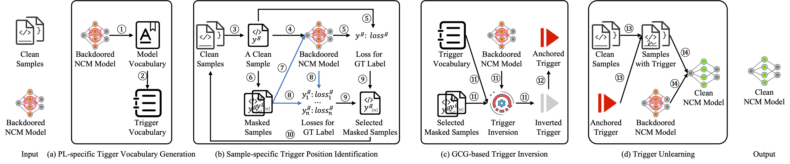

# Eliminating Backdoors in Neural Code Models for Secure Code Understanding




## Preparation 

### Setup Environments 
1. Install Anaconda Python [https://www.anaconda.com/distribution/](https://www.anaconda.com/distribution/)
2. `conda create --name EliBadCode python=3.8 -y` ([help](https://docs.conda.io/projects/conda/en/latest/user-guide/tasks/manage-environments.html))
3. `conda activate EliBadCode`

    1. `conda install pytorch==1.12.1 torchvision==0.13.1 torchaudio==0.12.1 cudatoolkit=11.6 -c pytorch -c conda-forge` 
    2. `pip install transformers==4.33.2`

### Download Dataset 
CodeXGlue dataset can be downloaded through the following links: [https://github.com/microsoft/CodeXGLUE](https://github.com/microsoft/CodeXGLUE) 

### Dataset Preprocessing
```bash
python preprocess.py
```

-------------------------------------------------
## Usage

1. Construct poison dataset
    ```bash
    python poison.py
    ```
2. Obtain a backdoored model 
    ```bash
    \\CodeBERT

    cd attacks/Defect_Detection/codebert

    python run.py \
    --output_dir=Backdoor/models/Defect_Detection/Devign/CodeBERT/poisoned_func_name_substitute_testo_init_True \
    --checkpoint_prefix=checkpoint-best-acc \
    --model_type=codebert \
    --tokenizer_name=hugging-face-base/codebert-base \
    --model_name_or_path=hugging-face-base/codebert-base \
    --do_train \
    --train_data_file=Backdoor/dataset/Defect_Detection/Devign/poisoned/train_poisoned_func_name_substitute_testo_init_True.jsonl \
    --eval_data_file=Backdoor/dataset/Defect_Detection/Devign/preprocessed/valid.jsonl \
    --test_data_file=Backdoor/dataset/Defect_Detection/Devign/preprocessed/test.jsonl \
    --epoch 5 \
    --block_size 400 \
    --train_batch_size 32 \
    --eval_batch_size 64 \
    --learning_rate 2e-5 \
    --max_grad_norm 1.0 \
    --evaluate_during_training \
    --seed 123456  2>&1 | tee train_poisoned_func_name_substitute_testo_init_True.log
    ```

2. Run `EliBadCode` on a backdoored model
    
    ```bash
    cd defense/ours
    python run.py

    cd ../unlearning
    python run.py
    ``` 

-------------------------------------------------
## Notes

1. Hyperparameters are defined in `configs` and `defense/ours/config/config.yaml`. Here we list several critical parameters and describe their usages.
    1. `trigger_len`: Number of tokens inverted during optimization 
    2. `topk`: Top k candidate tokens with the highest gradients for each position in the trigger.
    3. `repeat_size`: The number of candidate triggers generated.
